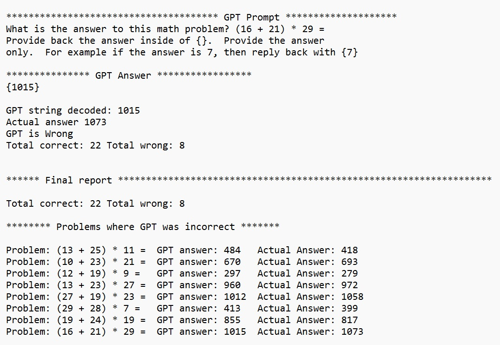

# AI Math Test
Docs 9-4-23 V1 (For questions or comments:  Stephen Witty switty@level500.com)  

### Project Overview:
This project seeks to test ChatGPT on a set of simple math problems.  By default, the problems are of the type (A + B) * C = where A, B, and C are random numbers between 0 and 30.  The Python script is available under the "Source" directory. The results of a sample run are under the "Results" directory.  ChatGPT does get a number of the problems incorrect.

### Usage:

- The software is a Python3 script and runs in the usual manner
- There is only one source code/script file
- A user must first install the OpenAI Python API (Google for instructions)
- User must enter their OpenAI API key toward the top of the Python script
- The GPT model can be selected in the source file
- Under Constants - assign the number of math problems to test with
- In the Python function create_problem() set the type of problem and number ranges